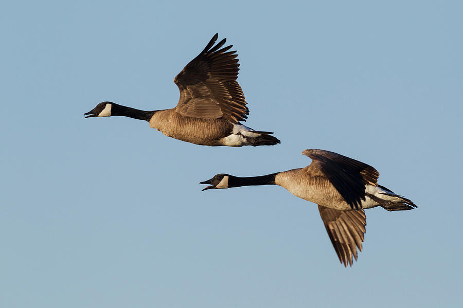

# {-}

{ width=50% }

# Einleitung {-}

Korrelationen spielen eine zentrale Rolle in der Statistik und in vielen wissenschaftlichen Disziplinen. Sie ermöglichen es uns, Zusammenhänge zwischen zwei oder mehr Variablen zu quantifizieren und zu interpretieren. 

Dieses Skriptum frischt Ihre bestehenden Grundkenntnisse über Korrelation auf und vertieft Ihr Verständnis der verschiedenen Korrelationstechniken. Ziel ist es, Ihnen die Werkzeuge an die Hand zu geben, um komplexe Datenbeziehungen zu analysieren und fundierte Schlussfolgerungen zu ziehen.
